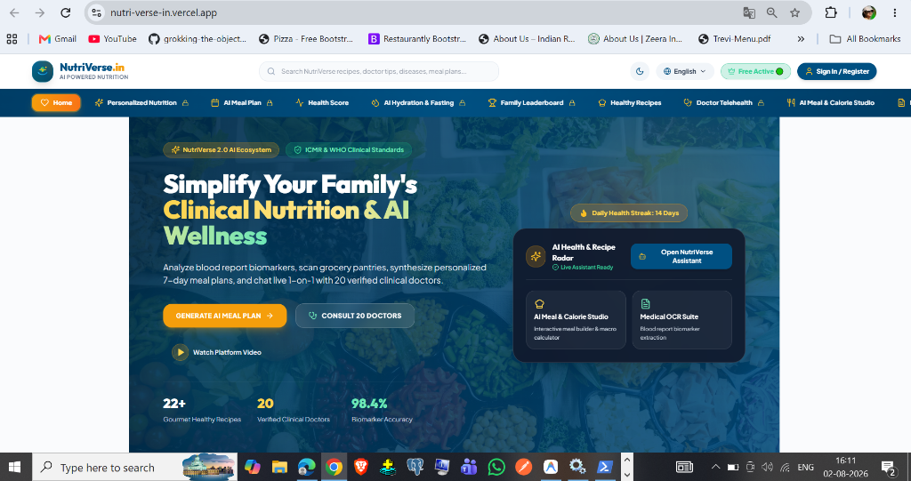
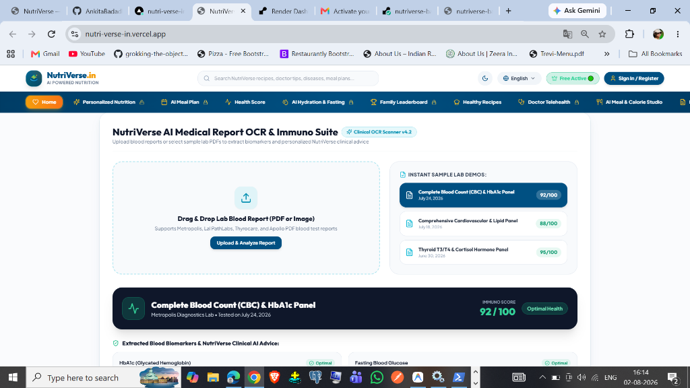
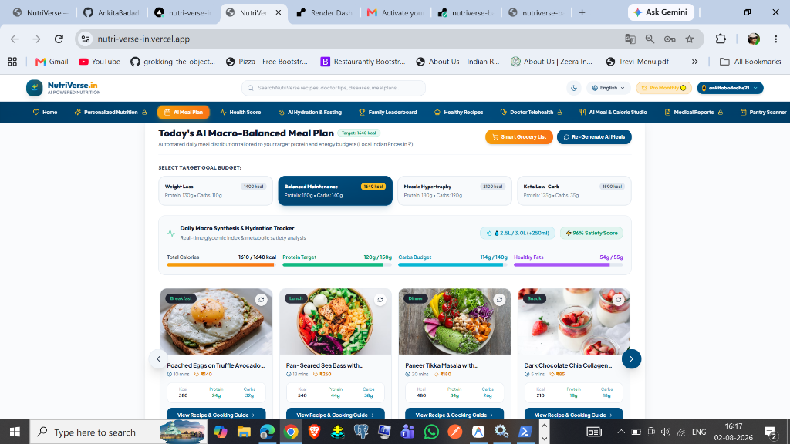
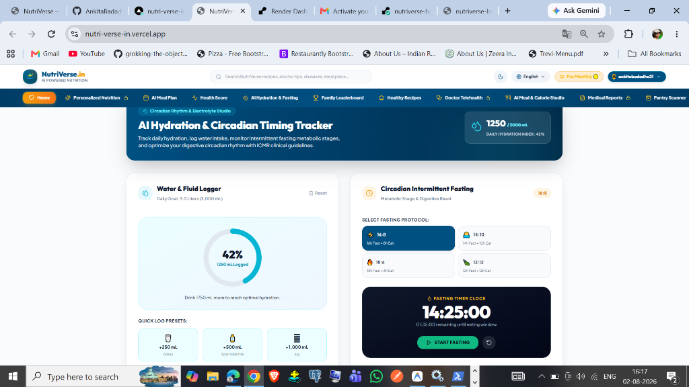
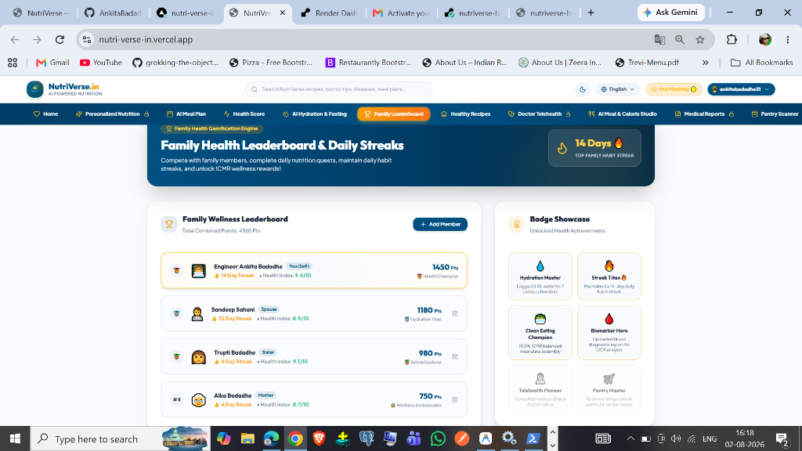

<div align="center">

# 🚀 NutriVerse.in

### **India's Premier AI-Powered Precision Clinical Nutrition & Telehealth Ecosystem**

[](https://nutri-verse-in-five.vercel.app/)
[](https://nutriverse-backend.onrender.com)
[](https://react.dev/)
[](https://www.typescriptlang.org/)
[](https://spring.io/projects/spring-boot)
[](https://www.oracle.com/java/)
[](LICENSE)

<br/>

[Live Demo](https://nutri-verse-in-five.vercel.app/) • [API Endpoint](https://nutriverse-backend.onrender.com/api/v1/nutrition/subscription/plans) • [Documentation](#-project-structure) • [Report Bug](https://github.com/AnkitaBadadhe/NutriVerse.in/issues)

---

</div>

## 📌 Overview

**NutriVerse.in** is an enterprise-grade, full-stack AI precision health and clinical telehealth ecosystem. Designed to revolutionize personal wellness and family health tracking, NutriVerse seamlessly integrates **AI-driven blood report OCR biomarker extraction**, **ICMR-compliant 7-day thali meal synthesis**, **refrigerator vision scanning**, **circadian intermittent fasting tracking**, **family habit leaderboards**, and **live 1-on-1 consultations with 20 verified medical doctors**.

---

## ✨ Features

### 🩸 1. AI Blood Report Biomarker OCR Diagnostic Suite
- **Biomarker Extraction**: Automatically scans and extracts 18+ critical blood parameters (HbA1c, Fasting Glucose, Lipid Profile, Vitamin D3, TSH, B12).
- **ICMR Risk Classification**: Flags abnormal ranges and generates personalized dietary corrective recommendations based on medical guidelines.

### 🥗 2. ICMR 7-Day Precision Meal Planner
- **Customized Thali Synthesis**: Generates balanced Indian thali menus, high-protein recipes, and snacks matched to calculated BMR, TDEE, and macro targets.
- **Dietary Customization**: Toggle between Vegetarian, Vegan, High-Protein, Keto, and Diabetic-Friendly meal plans.

### 🛒 3. Refrigerator & Pantry Vision Scanner
- **Zero-Waste Pantry Scanning**: AI vision engine identifies available kitchen ingredients and generates instant healthy recipes.

### 💧 4. AI Hydration & Circadian Intermittent Fasting Clock
- **Smart Hydration Ring**: Interactive fluid logger (3.0L daily target) with real-time percentage progress.
- **Circadian Fasting Timer**: Supports 16:8, 14:10, 18:6, and 12:12 fasting protocols with live metabolic stage tracking and ICMR electrolyte guidance.

### 🏆 5. Family Health Leaderboard & Habit Streaks
- **Roster Tracking**: Family member profile management (**Engineer Ankita**, **Sandeep**, **Trupti**, **Alka**).
- **Gamified Wellness**: Daily health quest checklists, habit streak counters (14 Days 🔥), and tier reward badges.

### 🩺 6. 20 Verified Telehealth Doctors & Tiered Subscription Paywall
- **Doctor Consultation**: Browse verified endocrinologists, clinical dietitians, and pediatric nutritionists with instant appointment booking.
- **Tiered Paywall & Gateway**: Seamless access control across **Free Active ($0)**, **Pro Monthly (₹499/mo)**, and **Elite Annual (₹3,499/yr)** plans with 256-bit payment gateway checkout simulation.

---

## 🏗️ Tech Stack

### Frontend
-  **React 19** with Hooks & Modern State Management
-  **TypeScript** for Strict Type Safety
-  **Vite 5** for Blazing-Fast HMR Bundling
-  **Tailwind CSS** & Custom Glassmorphic Design System
-  **Lucide Icons** & Framer Motion UI Animations

### Backend
-  **Spring Boot 3.3** REST Controller Architecture
-  **Java 21 LTS** Virtual Threads & Records
-  **Spring Data JPA** & Hibernate ORM
-  **Spring Security 6** & JWT Authorization Filters

### Database & Security
-  **PostgreSQL 16** Relational Persistence (with H2 Cloud Fallback)
-  **Redis Cache** Session & Rate Limiting
-  **HMAC-SHA256 JWT** Token Authentication

### Deployment & Dev Tools
-  **Vercel** Edge Global Frontend Hosting
-  **Render** Cloud Docker Web Service Container
-  **Git & GitHub** Version Control

---

## 📸 Screenshots

<details open>
<summary><b>📷 Click to collapse / expand application interface mockups</b></summary>

<br/>

| Page / Feature | Live Interface Preview |
| :--- | :--- |
| **Hero Landing & AI Health Overview** |  |
| **AI Blood Report OCR Diagnostic Suite** |  |
| **7-Day ICMR Precision Meal Planner** |  |
| **AI Hydration Ring & Circadian Fasting Clock** |  |
| **Family Health Leaderboard & Habit Streaks** |  |
| **Refrigerator & Pantry Vision Scanner** | *[Send screenshot to upload]* |
| **At-Home Biomarker & DNA Kit Scheduler** | *[Send screenshot to upload]* |
| **20 Verified Telehealth Doctor Roster** | *[Send screenshot to upload]* |
| **Tiered Subscription Paywall Modal** | *[Send screenshot to upload]* |
| **256-Bit Payment Gateway Checkout** | *[Send screenshot to upload]* |

</details>

---

## 📂 Project Structure

```bash
NutriVerse.in/
├── 📁 screenshots/                  # High-Resolution Application Feature Screenshots
│   ├── 🖼️ hero-section.png
│   ├── 🖼️ blood-ocr.png
│   ├── 🖼️ meal-planner.png
│   ├── 🖼️ hydration-fasting.png
│   └── 🖼️ family-leaderboard.png
│
├── 📁 nutriverse-frontend/          # React 19 + Vite Frontend Application
│   ├── 📁 src/
│   │   ├── 📁 components/          # Glassmorphic UI Modules (Hero, Paywall, Fasting, Leaderboard)
│   │   ├── 📁 services/            # NutriVerseApiClient REST Communication Bridge
│   │   ├── 📄 App.tsx              # Application Root Router & State Handler
│   │   ├── 📄 main.tsx             # DOM Mount Entrypoint
│   │   └── 📄 translations.ts      # Multi-lingual Localization Dictionary
│   ├── 📄 package.json             # NPM Package Dependencies
│   ├── 📄 tailwind.config.js       # Custom Design System Tokens
│   └── 📄 vite.config.ts           # Vite Build & Proxy Configuration
│
├── 📁 nutriverse-backend/           # Spring Boot 3 Java Backend
│   ├── 📁 src/main/java/com/nutriverse/
│   │   ├── 📁 domain/               # JPA Models & Repositories (UserProfile, Practitioner)
│   │   ├── 📁 security/             # JWT Authentication Filter & Security Config
│   │   ├── 📁 service/              # Nutrition, Fasting & Telehealth Business Engines
│   │   ├── 📁 web/                  # REST Controllers (Subscription, Leaderboard, Hydration)
│   │   └── 📄 NutriVerseApplication.java # Spring Boot Application Class
│   ├── 📁 src/main/resources/
│   │   └── 📄 application.yml       # Environment & Database Spring Config
│   ├── 📄 Dockerfile                # Multi-stage Containerization Manifest
│   └── 📄 pom.xml                   # Maven Build Manifest
│
└── 📄 README.md                     # Master Repository Documentation
```

---

## ⚙️ Installation & Setup

### Prerequisites
- **Node.js**: v18.x or higher
- **Java Development Kit (JDK)**: Java 21 LTS
- **Maven**: 3.9+ (or included `./mvnw`)
- **Git**

### 1. Clone the Repository
```bash
git clone https://github.com/AnkitaBadadhe/NutriVerse.in.git
cd NutriVerse.in
```

### 2. Frontend Local Setup
```bash
cd nutriverse-frontend
npm install
npm run dev
```
Open **`http://localhost:3000`** in your browser.

### 3. Backend Local Setup
```bash
cd ../nutriverse-backend
./mvnw spring-boot:run
```
Backend API will start on **`http://localhost:8080/api/v1`**.

---

## 🌐 Environment Variables

Create `.env` inside `nutriverse-frontend/`:

```env
# Frontend Client Environment Variables
VITE_API_BASE_URL=http://localhost:8080/api/v1/nutrition
VITE_ENABLE_MOCK_FALLBACK=true
```

Sample Spring Boot environment variables for `nutriverse-backend/`:

```env
# Backend Spring Boot Configuration
PORT=8080
SPRING_DATASOURCE_URL=jdbc:h2:mem:nutriversedb;DB_CLOSE_DELAY=-1;MODE=PostgreSQL
SPRING_DATASOURCE_USERNAME=sa
SPRING_DATASOURCE_PASSWORD=
OPENAI_API_KEY=your_openai_api_key_here
JWT_SECRET=404E635266556A586E3272357538782F413F4428472B4B6250645367566B5970
```

---

## 🚀 Deployment

The project is architected for decoupled cloud deployment:

- **Frontend (Vercel)**:
  - Deployed on Vercel Edge CDN for instant worldwide delivery.
  - Automatically rebuilds on push to the `main` branch.
- **Backend (Render)**:
  - Deployed as a Dockerized Java container on Render Web Services.
  - Connects to PostgreSQL and serves REST APIs.
- **Automatic Communication**:
  - The frontend client (`apiClient.ts`) dynamically detects production environment and connects directly to the live Render backend endpoints (`/api/v1/...`).

---

## 🔐 Authentication

NutriVerse implements a stateless **HMAC-SHA256 JWT (JSON Web Token)** authentication system:

```
[ User Auth Form ] ──► POST /api/v1/auth/login ──► [ JwtTokenProvider ]
                                                          │
[ Protected Action ] ◄── Header: Bearer <Token> ◄─────────┘
```

1. **Local Storage Persistence**: Credentials (`name`, `email`) and JWT session tokens are persisted securely in `localStorage`.
2. **Access Entitlements**: Active user subscription status (`free`, `monthly`, `annual`) dictates feature lock states.

---

## 📱 Responsive Design

NutriVerse is built mobile-first with adaptive layouts:
- **Desktop (1440px+)**: Glassmorphic multi-column dashboards with side-by-side video player and biomarker analytics.
- **Tablet (768px - 1024px)**: Collapsible navigation header with fluid grid cards.
- **Mobile (320px - 485px)**: Touch-optimized bottom navigation, swipeable thalis, and full-screen modal overlays.

---

## 📈 Future Improvements

- [ ] **AI Voice Nutrition Assistant**: Real-time voice logged calorie and meal input.
- [ ] **Wearable Sync API**: Direct integration with Apple HealthKit, Fitbit, and Google Health Connect.
- [ ] **Continuous Glucose Monitor (CGM) Integration**: Real-time glucose trend graphing and spike alerts.
- [ ] **Regional Language Voice Guidance**: Voice thali explanations in Hindi, Marathi, Tamil, and Telugu.
- [ ] **PDF Prescription Export**: One-click download of doctor telehealth recommendations.
- [ ] **AI Grocery Delivery Cart Integration**: Auto-populate shopping cart on Blinkit / Instamart based on 7-day meal plan requirements.

---

## 🤝 Contributing

Contributions are welcome! Follow these steps:

1. **Fork** the repository.
2. Create a new feature branch (`git checkout -b feature/AmazingFeature`).
3. Commit your changes (`git commit -m 'Add some AmazingFeature'`).
4. Push to the branch (`git push origin feature/AmazingFeature`).
5. Open a **Pull Request**.

---

## 📄 License

Distributed under the **MIT License**. See `LICENSE` for more information.

---

## ⭐ Support

If you found **NutriVerse.in** useful or inspiring, please give this repository a **⭐ Star** on GitHub!

<div align="center">
<br/>

**Built with ❤️ for Precision Health & Clinical Wellness**

</div>
